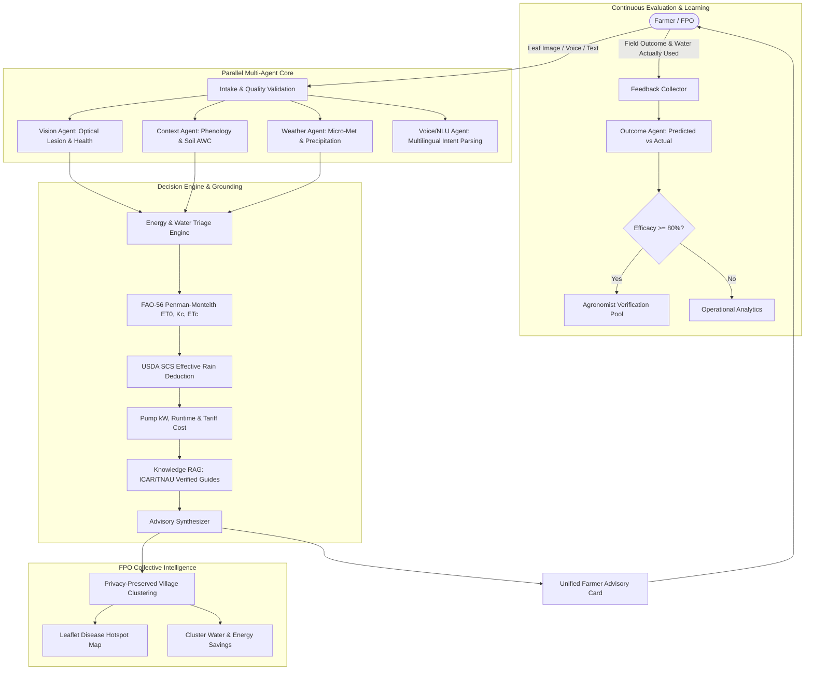

# AgriEdge
### Farmer-Owned Intelligence for Water, Energy & Crop Productivity

> **Primary Tagline:** *"Save Water. Save Energy. Grow Smarter."*  
> **Secondary Tagline:** *"AI-powered agricultural intelligence in the farmer's own language."*  
> **Core Philosophy:** *"Replace expensive physical sensors with software intelligence wherever possible."*

---

## 🌾 Project Overview

AgriEdge is a production-quality, multilingual, full-stack agricultural decision platform built for smallholder farmers and Farmer Producer Organizations (FPOs). 

Most agricultural AI products stop at: *"Here is your leaf disease."*  
AgriEdge unites crop health diagnostics, meteorological precipitation forecasts, FAO-56 Penman-Monteith evapotranspiration modelling, pump energy consumption calculations, and verified extension agronomy into a single actionable decision:

- **What is happening to my crop?** (Foliar disease, severity %, and affected area)
- **What does the weather say?** (24h–48h rain forecast & waterlogging hazards)
- **Do I need to water?** (FAO-56 Penman-Monteith ET0, Kc, and effective rain deduction)
- **How much water and pump energy will that save?** (Pumping runtime, kWh, and cost)
- **What should I do next?** (Verified ICAR and TNAU agronomic treatments)
- **What happened when I followed the advice?** (Closed-loop feedback & Outcome Agent evaluation)

---

## 🏗 System Architecture



---

## ⚡ Key Technical Features

1. **FAO-56 Penman-Monteith Computational Engine:** Deterministic calculation of reference evapotranspiration ($ET_0$), growth stage coefficients ($K_c$), crop evapotranspiration ($ET_c$), and USDA SCS effective precipitation deduction ($P_e$).
2. **Pump Power & Energy Optimization:** Accurate kilowatt calculations based on pump horsepower, runtime hours, electric grid tariffs, and diesel fuel consumption metrics.
3. **Computer Vision Leaf Diagnostics:** Input validation (blur score via Laplacian edge variance, luminance checks, resolution minimums), spectral lesion segmentation, and agronomist verification warnings when confidence $< 80\%$.
4. **Verified RAG Knowledge Retrieval:** Agronomic treatment recommendations grounded in verified packages of practices from the Indian Council of Agricultural Research (ICAR) and Tamil Nadu Agricultural University (TNAU) with prompt sanitization.
5. **Privacy-Preserving FPO Disease Hotspot Map:** Aggregates outbreaks to village and block centroids; individual farmer GPS coordinates are never publicly rendered.
6. **Closed-Loop Outcome Feedback Agent:** Compares predicted vs actual farmer actions and evaluates advisory efficacy without uncontrolled model retraining.
7. **Multilingual Voice & NLU:** Speech-to-text, intent routing (`IRRIGATION_QUERY`, `DISEASE_QUERY`, `WEATHER_QUERY`), and text-to-speech audio feedback across English, Hindi, and Tamil.
8. **Offline-First PWA:** Service worker caching and background sync queue allowing farmers to record observations without active internet connectivity.
9. **Judge / Demo Mode:** Transparent banner and 1-click role switcher (Farmer Ramesh, FPO Lead, System Observability) for instant hackathon evaluations.

---

## 💻 Tech Stack

- **Frontend:** React 18, TypeScript, Vite, Tailwind CSS, Lucide Icons, Recharts, Leaflet, Framer Motion, TanStack Query.
- **Backend:** Python 3.11+, FastAPI, Pydantic V2, SQLAlchemy 2.0, Native Bcrypt, PyJWT, HTTPX, Pillow, NumPy.
- **Database:** SQLite (local zero-config) / PostgreSQL (production-ready).
- **Testing:** Pytest with 26 automated unit and integration tests.
- **Containerization:** Docker Compose (PostgreSQL, Redis, FastAPI, Nginx).

---

## 📁 Monorepo Structure

```
agriedge/
├── apps/
│   ├── web/                    # React 18 + TypeScript + Vite frontend
│   └── api/                    # FastAPI backend with REST endpoints
├── services/
│   ├── irrigation/             # FAO-56 Penman-Monteith & pump energy engines
│   ├── weather/                # OpenWeatherMap client & Rainfall hazard agent
│   ├── vision/                 # Image quality check & optical lesion pipeline
│   ├── crop_stage/             # Phenological tracking & GDD calculations
│   ├── knowledge/              # ICAR / TNAU RAG retrieval & prompt sanitization
│   ├── advisory/               # Multi-agent advisory orchestrator
│   ├── scenario/               # What-if scenario simulation engine
│   ├── market/                 # APMC market & cold storage abstractions
│   ├── feedback/               # Outcome Agent & continuous feedback evaluation
│   ├── fpo/                    # FPO analytics & privacy-preserving map clusters
│   └── admin/                  # System observability, latency & cost tracking
├── docker/                     # Dockerfiles & Nginx reverse proxy configuration
├── docs/                       # Architecture, API, Security, and Demo documentation
├── tests/                      # Automated test suite (26 passing tests)
├── .env.example                # Example environment variables
├── docker-compose.yml          # Container orchestration specification
└── package.json                # Monorepo root configuration
```

---

## 🚀 Quickstart & Local Setup

### 1. Prerequisites
- Python 3.11+
- Node.js 18+ and npm

### 2. Environment Setup
```bash
# Clone the repository
git clone https://github.com/your-org/agriedge.git
cd agriedge

# Setup environment file
cp .env.example .env
```

### 3. Backend Setup
```bash
# Initialize Python virtual environment
python -m venv .venv

# Activate virtual environment
# Windows:
.\.venv\Scripts\activate
# Linux/macOS:
source .venv/bin/activate

# Install dependencies
pip install -r apps/api/requirements.txt

# Run automated tests (26 tests)
pytest tests -v

# Start FastAPI backend server (Port 8000)
uvicorn apps.api.main:app --host 127.0.0.1 --port 8000 --reload
```
*Note: SQLite database is created and auto-seeded with sample farmer and FPO entities automatically on startup.*

### 4. Frontend Setup
In a new terminal window:
```bash
# Navigate to web application directory
cd apps/web

# Install frontend dependencies
npm install

# Start Vite development server (Port 5173)
npm run dev
```

Open your browser at: **`http://localhost:5173`**

---

## 🧪 Automated Test Suite

AgriEdge includes 26 deterministic automated tests covering computational models, security, and vision validation:

```bash
pytest tests -v
```

**Tested Components:**
- FAO-56 Penman-Monteith reference evapotranspiration ($ET_0$)
- Stage-specific crop coefficient ($K_c$) lookup
- USDA SCS effective rainfall calculation ($P_e$)
- Irrigation triage logic: `SKIP IRRIGATION`, `REDUCE IRRIGATION`, `IRRIGATE NOW`
- Pump electrical runtime & diesel consumption equations
- Image quality validation (blur variance, overexposure, low resolution)
- Local optical chlorosis/necrosis classification
- Crop phenology progression & manual stage overrides
- Rainfall hazard analysis (flood risk, dry spell detection)
- Knowledge RAG prompt injection sanitization & citation verification
- Scenario comparison metrics
- Outcome Agent efficacy scoring & dataset curation
- Password bcrypt hashing and JWT cryptographic signature verification

---

## 🐳 Docker Deployment

To launch the full production stack using Docker Compose:

```bash
docker compose up -d --build
```
- Frontend: `http://localhost:3000`
- Backend API: `http://localhost:8000`
- Interactive API Docs: `http://localhost:8000/docs`

---

## 🛡 Security & Transparency Policy

- **No Fake Live Data Claims:** When external weather or market API keys are unconfigured, data is explicitly badged as *"Local development fallback"*.
- **No Unfounded Soil Moisture Claims:** Water status is explicitly labeled *"Estimated soil water status"*, never *"Measured soil moisture"*.
- **AI Safety:** Dangerous pesticide prescriptions are banned; all chemical recommendations require on-site extension verification.
- **Privacy Minimization:** FPO disease hotspot maps strictly aggregate to village/block centroids; exact farm GPS coordinates are never publicly rendered.

---

## 📜 License
Apache-2.0. Built for the Hackathon Technical Showcase.
