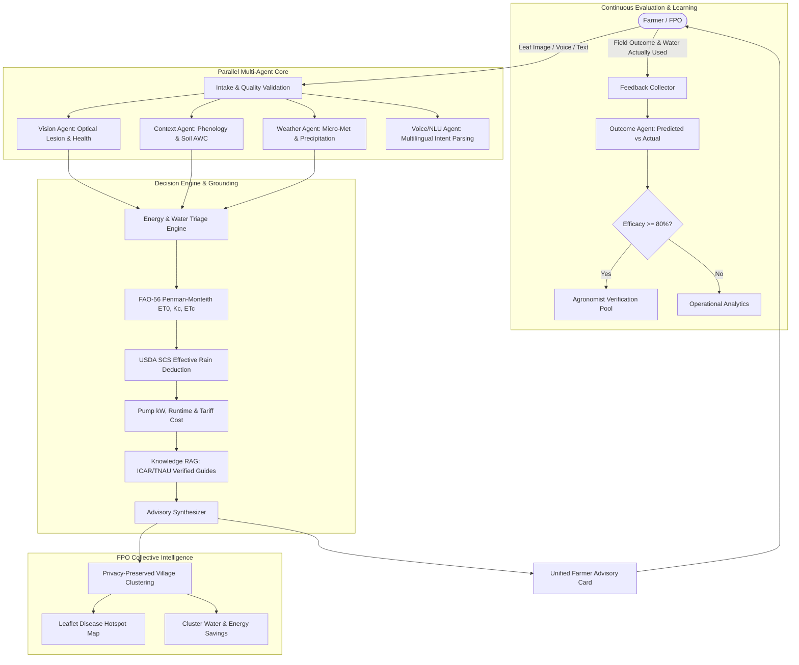

# AgriEdge Architecture Specification

> **Tagline:** Save Water. Save Energy. Grow Smarter.  
> **Core Principle:** Replace expensive physical sensors with software intelligence wherever possible.

---

## 1. System Overview & End-to-End Flow

AgriEdge is an agro-technological intelligence platform designed for small and marginal farmers, Farmer Producer Organizations (FPOs), and agricultural extension officers. It unites foliar image diagnostics, weather forecasts, FAO-56 Penman-Monteith evapotranspiration modelling, pump energy optimization, and verified agronomic RAG into a single, cohesive decision engine.

---

## 2. Agent Descriptions & Responsibilities

| Agent Name | Primary Responsibility | Deterministic Standard |
| :--- | :--- | :--- |
| **VisionAgent** | Image quality check (blur, luminance, min resolution), optical chlorosis/necrosis ratios, foliar disease classification. | Laplacian edge variance & Spectral thresholding |
| **ContextAgent** | Determines days elapsed since sowing, phenological stage (Seedling, Vegetative, Flowering, Fruiting, Maturity), and soil available water capacity (AWC). | Crop calendar & Soil texture classification |
| **WeatherAgent** | Live OpenWeatherMap integration with TTL caching and agro-met fallback simulator. | Caching TTL (15 min) |
| **RainfallAgent** | Evaluates precipitation probability, intensity, flood/waterlogging hazards, dry spells, and safe irrigation windows. | Probabilistic hazard analysis |
| **EnergyWaterTriageAgent** | Calculates reference evapotranspiration ($ET_0$), stage coefficient ($K_c$), crop evapotranspiration ($ET_c$), USDA SCS effective rainfall ($P_e$), net and gross irrigation requirements, pump runtime, electrical/diesel consumption, and potential avoided water/energy. | **FAO Irrigation and Drainage Paper 56** |
| **KnowledgeAgent (RAG)** | Semantic & keyword retrieval across verified ICAR, TNAU, and State University package-of-practices guides with prompt injection sanitization. | Verified extension publications |
| **ScenarioAgent** | Simulates what-if scenarios (e.g. "Wait 2 days", "Reduce irrigation by 20%", "Rainfall 20mm"). | Comparative decision simulation |
| **MarketAgent** | APMC/Agmarknet market intelligence and cold storage provider interface. | Real-data enforcement (No fabricated prices) |
| **OutcomeAgent** | Compares predicted irrigation actions vs actual field results, calculates adherence and water/energy variance, and curates retraining datasets. | Verified agronomic evaluation |

---

## 3. FAO-56 Penman-Monteith Formulation

Reference evapotranspiration ($ET_0$) is calculated in accordance with FAO-56 Equation 6:

$$ET_0 = \frac{0.408 \Delta (R_n - G) + \gamma \frac{900}{T + 273} u_2 (e_s - e_a)}{\Delta + \gamma (1 + 0.34 u_2)}$$

- **Crop Water Consumption:** $ET_c = ET_0 \times K_c$
- **Effective Rainfall ($P_e$):**
  $$P_e = P \times \frac{125 - 0.2 P}{125} \quad (P \le 250\text{ mm})$$
- **Gross Irrigation Requirement:**
  $$IN_g = \frac{\max(0, ET_c - P_e)}{\eta_a}$$
  where $\eta_a = 0.90$ for drip irrigation, $0.75$ for sprinkler, and $0.60$ for flood irrigation.
- **Pumping Power & Energy:**
  $$P_{\text{kW}} = \text{HP} \times 0.7457, \quad \text{Energy (kWh)} = P_{\text{kW}} \times \text{Runtime (hours)}$$
